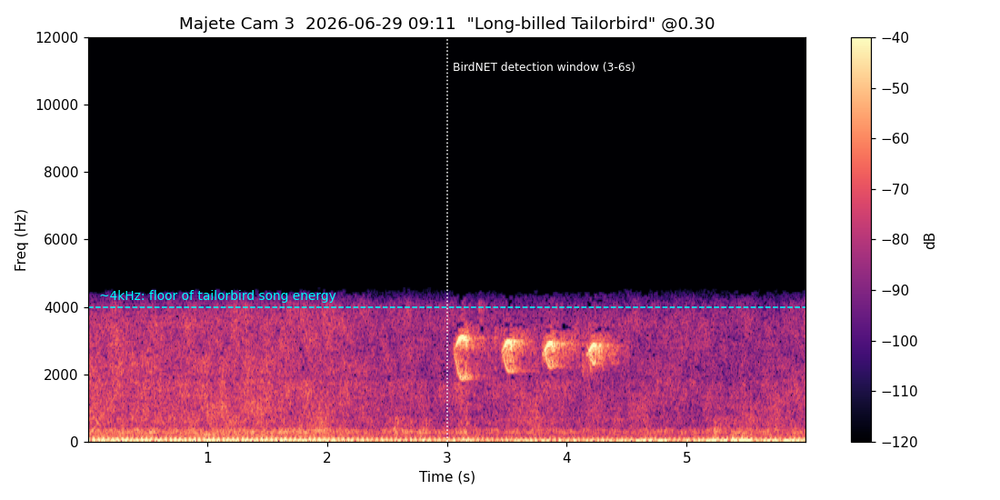

# Detection examples

Curated, evidence-backed example detections for the system-performance writeup.
Two kinds: **showcases** (the system working well) and **failure modes** (how
and why it goes wrong). Each entry cites a real detection id so it can be pulled
back up in `/review`.

Query one by id:

```sql
SELECT id, source_name, started_at, scientific_name, common_name,
       confidence, label, suggested_species
FROM detections WHERE id = <id>;
```

---

## Failure modes

### High-confidence-looking rarity that sails past the range filter

**Long-billed Tailorbird** — detection `397737` · Majete Cam 3 · 2026-06-29
09:11 · conf **0.30** · labeled `bad`.



*Artisornis moreaui* is Critically Endangered and restricted to mid-elevation
evergreen-forest tangles in NE Tanzania (East Usambaras) and NE Mozambique
(Njesi Plateau) — nowhere near lowland Shire-valley Malawi. It should never
appear at Majete, yet the detection was logged. Why it's a good teaching case:

- **The range filter does not catch it.** BirdNET's eBird meta-model still lists
  *A. moreaui* among the ~496 allowed species at Majete's coordinates
  (-15.92, 34.75). The meta-model's grid is too coarse to resolve the
  tailorbird's tiny disjunct range from Majete, so geography alone can't reject
  it — the same "range filter too coarse" root cause behind the marine-bird FPs.
- **The acoustics are decisive.** The clip has essentially **zero energy above
  3 kHz** (0.3% in 3–5 kHz, 0% higher): 53% sub-500 Hz wind/hum rumble plus four
  bouncy inverted-U notes at 1.5–3 kHz pulsing ~2.8/sec. A real Long-billed
  Tailorbird sings high, thin, squeaky notes — "peelik-peelik," a "chhet" like a
  squeaky dog's toy, a buzzy "dzit" — with energy up in the **4–8 kHz** band.
  Total spectral mismatch (cyan line marks the ~4 kHz floor of the real song).
- **BirdNET's own runner-ups betray it.** With the location filter off, every
  alternative is an unrelated melodic thrush-type singer (Red-crowned
  Ant-Tanager, Ring Ouzel, Song/African/Pale-breasted Thrush, Long-billed
  Bernieria) — the scatter signature of the model guessing at an out-of-domain
  sound. The four ~2.5 kHz notes most plausibly belong to a melodic passerine
  already resident on this camera (Collared Palm-Thrush / Olive-flanked
  Robin-Chat).

**Takeaways for the writeup:** (1) the range filter is a coarse gate, not a
guarantee — rarities with tiny disjunct ranges can pass it; (2) confidence
below the ≥0.7 trust floor plus a spectral-band mismatch is the reliable tell;
(3) a "surprising" rarity ID is a prompt to check the spectrogram, not to
celebrate.

See also: **Grey Plover** 228 detections @ up to 0.99 — the high-confidence FP
poster child (site+time-locked acoustic collision), documented in the month-1
deep-dive.
